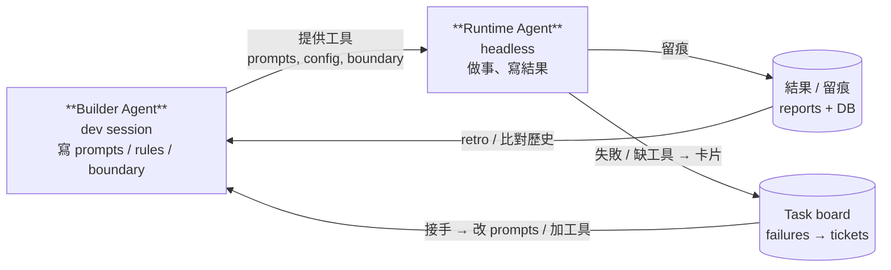

# 把 LLM agent 拆成兩個:Builder vs Runtime

  

> 一個 build,一個 run,**互相不能改對方寫的東西** — 但會學對方的失敗。

  

---

  

## 為什麼單一 agent 不夠

  

如果你在做一個會 24/7 自動跑的 LLM agent — 不管是 production 客服、文件整理 daemon、量化交易輔助、scheduled report writer、任何 long-running 的 scheduled job — 你大概撞過這幾個經典問題:

  

1. **Runtime 出包就把開發環境也燒了**。LLM 在 production fire 裡幻覺出一個「修一下 prompt」的念頭,改了 prompt 檔,下次 fire 讀到改壞的 prompt,然後一路歪。沒有審稿 layer。

2. **「我現在是誰」很模糊**。同一個 agent persona 同時是「做事的人」+「改自己工具的人」,情境一切,LLM 就會混 — 做事做到一半開始改自己工具,或反過來。

3. **改 production 沒留痕**。dev 跟 runtime 撞同一個身份,git log 看不出哪個 commit 是工程師 retro 改的、哪個是 fire 裡 LLM 幻覺改的。

  

我試過 AutoGPT 那條路(讓單一 agent 自己 build + run + 改自己工具),**一週內就失控**。也看過 Orchestrator-Worker pattern — 但那是「一次任務拆 sub-task」,是 runtime 內的分工,**不是**「開發 vs 上線」的時間軸切分。

  

那個切分才是真正的核心。把 agent 拆成兩個角色,中間用檔案系統通訊:

  

- **Builder Agent** — 工程師 + agent 互動的 dev session,負責設計、寫工具、改流程、定規則。

- **Runtime Agent** — 真正上場執行的 agent,讀 Builder 寫好的東西,在邊界內做事、留痕。

  

兩者**共用同一個 codebase + 同一個目標**,但**身份隔離 + 權責不對稱**。

  

---

  

## 切法:兩個角色各做什麼

  

### Builder Agent — 建造者

  

- 工程師坐在電腦前開 interactive session,寫 / 改一切 — collectors、prompts、boundary 文件、config、ADR、docs

- 權限:**整個 repo 都可以動**

- 工具:Plugin、MCP server、互動時間長、思考可以慢

- 跑哪:工程師的電腦 + 工程師的時間

- 不在 production 流量路徑上

  

### Runtime Agent — 執行者

  

- 被 scheduler(cron / systemd timer / cloud function)或事件喚起,headless 跑

- Bootstrap 是**獨立的一份**(不是 dev 那份),用不同 working dir / 不同 system prompt

- 任務:讀 Builder 寫好的 prompts + 預抓的 context + boundary 文件,做事、寫結果、留痕

- 權限:**鎖死**。透過啟動 flag 做軟隔離:限定可讀目錄、強制 inject persona、載 deny ACL

- 跑哪:server + 24/7,工程師睡著也跑

- 是 production

  

關鍵差別 — Runtime Agent 的能力**完全來自 Builder 寫了什麼**。Runtime 不能私自 read 一個沒被授權的目錄、不能呼叫一個沒在 settings 開啟的工具、不能違反 boundary doc。**邊界鎖死**。

  

---

  

## 鐵則:Runtime 永遠不能改 Builder 寫的東西

  

這是整個 framework 最重要的 invariant,也是這個切法跟 AutoGPT 自循環的本質差別。

  

Runtime 在 fire 期間**只能寫**:

- 結果產物(reports、產出 artifact)

- 留痕資料(SQLite / log 表記錄 cost / model / decisions)

- 自己剛產生 artifact 的 git commit(**不 push**)

  

Runtime **永遠不寫**:

- 程式碼(collectors / handlers / utilities)

- Config 檔(rules / 規則 / watchlist)

- 自己讀的 prompt 檔

- 設計文件

- 任務看板

  

為什麼這條這麼硬?因為 **LLM 幻覺直接改 production 行為**是讓 agent 系統失控最快的方式。Runtime 如果能改 prompt,它會在某次 fire「靈光一閃」把 boundary 裡的 NEVER 規則改成 PROACT — 然後下次 fire 就真的去做了。

  

那 Runtime 怎麼「貢獻」回 Builder?**透過留痕**:

  

- 結果寫得不對 → 工程師 retro 時讀到,開卡改 prompt

- log 看到 max-turns 撞牆 / cost spike → 改 config

- 規則漏命中 / 誤命中 → 改 rules

- 用戶採用率低(如果有 feedback signal)→ 改 prompt

  

**改的動作永遠由 Builder 接手**,過 review / kanban / ADR 流程才落地。Runtime 只能「留痕 + 失敗」,演化動作是人的事。

  

---

  

## 環:Feedback Loop 才是核心

  

兩個 agent 不是平行協作 — 是 **build 端 ↔ run 端**的雙向 feedback 環:

  



  

兩個方向都有 channel,缺一個環就斷掉:

  

- **Builder → Runtime**(provisioning):Builder 寫的東西是 Runtime 的能力上限。

- **Runtime → Builder**(feedback):Runtime 跑完留痕,失敗 / 缺工具 / 行為漂移會浮現成卡片由 Builder 接。**這條環是「自我演化」的關鍵**;沒有這條,Builder 就是在閉門造車。

  

---

  

## 跟其他 pattern 的差別

  

當我跟朋友描述這個切法,常被問「這不就是 X 嗎?」 — 老實講不是,但有 published 前例可以對齊。

  

| Pattern | 出處 | 跟 Builder / Runtime split 的差別 |

|---------|------|-------------------|

| **LATM**(LLM as Tool Maker) | Cai et al. 2023, NeurIPS([arXiv:2305.17126](https://arxiv.org/abs/2305.17126)) | 最接近的前例。LATM 是「一個 LLM 寫工具,另一個用」 — 同精神,但 LATM 沒強調 runtime 邊界鎖死跟 feedback 環。|

| **Voyager skill library** | Wang et al. 2023([arXiv:2305.16291](https://arxiv.org/abs/2305.16291)) | Voyager 在 Minecraft 累積可重用 skill;Builder 累積給 Runtime 的 prompts / configs / helper scripts 就是 skill 庫。|

| **Reflexion** | Shinn et al. 2023([arXiv:2303.11366](https://arxiv.org/abs/2303.11366)) | Reflexion 是 agent 反思自己的失敗。Runtime → Builder feedback 就是 Reflexion,但**人介入**才落地。|

| **Orchestrator-Worker** | Anthropic patterns | 解決「一次任務拆 sub-task」,是 runtime 內的分工,**不是**「開發 vs 上線」的時間軸切分。完全不同問題。|

| **AutoGPT 自循環** | — | 讓單一 agent 自己 build + run + 改自己,沒有審稿 layer。runtime 出包就把開發環境也燒了。|

| **CAMEL / AutoGen 多 agent 協作** | — | 適合 brainstorming;不適合 production 這種「規則嚴 + 留痕嚴」場景。|

  

可以把這個切法稱為 **"Builder–Runtime Agent Loop"** — 不打算 push 成通用學名,只是讓討論有個錨點。

  

---

  

## 怎麼落地

  

不限定特定 framework / language,只要做到三件事:

  

### 1. 兩份 bootstrap doc,各跑各的

  

- Builder 用一份 bootstrap(讓 dev 互動 session 啟動,可以是工程師日常用的 CLAUDE.md / system prompt)

- Runtime 用另一份(讓 headless invocation 啟動,inject 不同 persona / boundary)

- 兩份**互不引用**,避免身份污染

- 如果用 Claude Code:兩份 `CLAUDE.md` 在不同目錄就好。其他 framework 等效機制就好。

  

### 2. Runtime 走 soft isolation flags

  

用啟動參數實現「Runtime 只能做事,不能改自己」。以 Claude Code 為例:

  

```bash

runtime_invocation \

  --add-dir <允許讀的目錄們> \             # 限 file access

  --append-system-prompt-file SCOPE.md \   # 強制 inject boundary

  --settings settings.json \               # 載 deny rules(write/edit ACL)

  --dangerously-skip-permissions \         # headless 無 TTY

  "$(cat prompts/<task>.md)"               # task-specific prompt

```

  

`SCOPE.md` 跟 `settings.json` 的 deny rules 是安全網 — 即使 Runtime 想 `Write(collectors/...)`、`Bash(rm -rf*)`、`Bash(git push*)`,都會被擋。**驗證過** deny rules 在 skip-permissions 下確實 hard-block(不是只擋 prompt 詢問,是真的不執行)— 沒測過的話自己寫個 repro 確認再上 production,這是 trust-but-verify。

  

### 3. 用檔案 / DB / Task board 做 feedback channel

  

Builder 跟 Runtime 不直接對話。中間靠:

  

- Runtime 寫的**結果 + log** → Builder retro 時讀

- Runtime 寫的**留痕表** → 累計 metric / cost / quality

- 失敗事件 → 寫成 task card,進 Builder 的接卡流程

  

具體選什麼 store 不重要(SQLite / Postgres / S3 / Jira / Linear / GitHub Issues 都可以),重要的是 **單向資料流** — Runtime 只寫、Builder 只讀、改的動作走人類審稿。

  

### 加分:用 Python 預抓 context 給 Runtime

  

落地時發現一個讓 Runtime 成本大幅下降的 trick — **在 fire 之前用 Python 把 deterministic state 預抓**(資料庫查詢、最近 N 筆 history、config snapshot),組成一塊 markdown 直接 append 在 prompt 後面當 context。

  

這樣 Runtime 收到時所有 deterministic state 已經在 context 裡,**不用燒 turn 跑 SQL / API 查詢**,turn 全部花在判斷跟產出上。

  

這是 Builder 寫工具給 Runtime 用的具體例子 — 你做的不是另一個 LLM agent,而是一個 Python script。Builder 寫好它,Runtime 只是個 consumer。**讓不該用 LLM 解的問題不要用 LLM 解**。

  

---

  

## Tradeoff:老實面對

  

這個 framework 不是 silver bullet,給你看缺點:

  

1. **維護成本翻倍**。兩份 bootstrap / 兩套 settings / 兩份 persona doc 要平衡。一邊改了 boundary、另一邊忘記 sync 就會踩坑。

2. **沒有 hard isolation**。Soft isolation 靠 flag + ACL — 單一 user 場景成立,multi-tenant SaaS 場景需要更強的隔離(進程 / 容器 / 帳號層級)。

3. **失敗 latency 高**。Runtime 寫了一份歪結果,要等到工程師 retro(可能是隔天)才會被發現、開卡、改 prompt、下次 fire 才修。如果 fire 頻率快、回饋慢,中間漏掉的決策可能很多。要有 monitoring 看著。

4. **不適合「探索性」工作**。Builder / Runtime 切分前提是「Builder 已經知道 Runtime 該怎麼做」 — 兩邊的合約(prompts / boundary)穩定。如果還在摸索階段(連 task profile 都不確定),拆兩個只會增加切換成本。

5. **跨 session memory 靠檔案系統**。Builder 跟 Runtime 不直接對話 — 全部透過 store。**設計這個 store schema 是 framework 的隱藏成本**,規模大會撞牆,要有長期演化路徑(向量索引 / 遷 Postgres / 等等)。

  

---

  

## 適合誰 / 不適合誰

  

可以參考這個切法:

  

- **24/7 自動跑**的 agent,不能依賴 owner 在電腦前

- **規則嚴 + 留痕嚴**(每次決策都要可審計、可 retro)

- **單一 user / 單一 deploy target**(不必擔心 multi-tenant 隔離)

- **任務 profile 穩定**(已經知道 agent 該做什麼)

- **成本敏感**(每個 ReAct turn 都算錢)

  

**不適合**套這個 framework 的場景:

  

- 還在「我的 agent 要做什麼都不確定」的探索期 → 先讓單一 agent 滾,等穩定再拆

- multi-tenant SaaS → 要硬隔離 + 進程隔離,不只是 flag 軟隔離

- 純 chat 應用 → 沒有「dev 跟 runtime 分離」的問題,單一 agent 就好

- 沒有 production 跑的需求(只在 IDE 互動)→ over-engineering

  

---

  

## 結尾

  

我把這個切法落地進一個真的會自動跑、會花我訂閱錢、會自動 commit 進 git 的 production agent。它不完美 — 但比單一 agent 自循環的版本穩定**很多**,而且最重要的是 — **我看得懂它每一步在幹嘛**。

  

對我來說,LLM agent 不應該自己改自己。Builder 寫,Runtime 跑,中間用 markdown 跟 DB 跟 task card 通訊。這個 invariant 讓我半夜睡覺時不用擔心明天醒來看到 agent 自己改了 boundary 然後幻覺去做了什麼。

  

如果你也在做類似的 agent,歡迎用這個分法。或者告訴我哪裡不對 — 我準備好被打臉。

  

---

  

*想看完整 framework 文件 + 一個真的跑這個 pattern 的 production agent 長什麼樣,可以參考 [`narrative-fin-agent`](https://github.com/kirinchen/narrative-fin-agent) — Builder / Runtime split 就是從那個 repo 長出來的。*